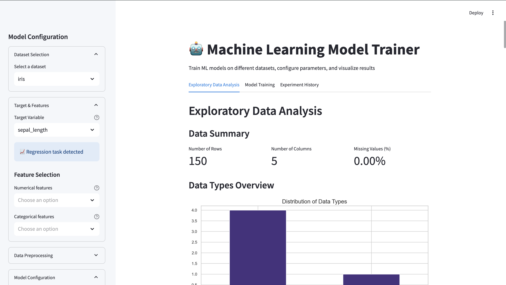

# Machine Learning Model Trainer

A Streamlit application for training and evaluating machine learning models on various datasets.

## Features

*   Dataset selection (Iris, Tips, Diamonds, Titanic, MPG, Penguins) and custom CSV upload.
*   Automatic detection of classification or regression tasks based on the target variable.
*   Exploratory Data Analysis (EDA) tab with data summaries, type overviews, missing value analysis, correlation heatmaps, feature distributions, and more.
*   Configurable data preprocessing options (missing value handling, scaling, encoding).
*   Selection from various classification and regression models (Random Forest, Gradient Boosting, SVM, KNN, Linear/Logistic Regression, etc.).
*   Optional Grid Search for hyperparameter tuning.
*   Model performance visualization (metrics, prediction plots, confusion matrix, ROC curve, feature importance).
*   Experiment history tracking and comparison.
*   Downloadable model reports (JSON format).

## Screenshot



## Setup

1.  Clone the repository:
    ```bash
    git clone https://github.com/rayen003/ML_model_visualization.git
    cd ML_model_visualization
    ```
2.  Install dependencies:
    ```bash
    pip install -r requirements.txt
    ```
3.  Run the Streamlit app:
    ```bash
    streamlit run a1/A1.py
    ```
